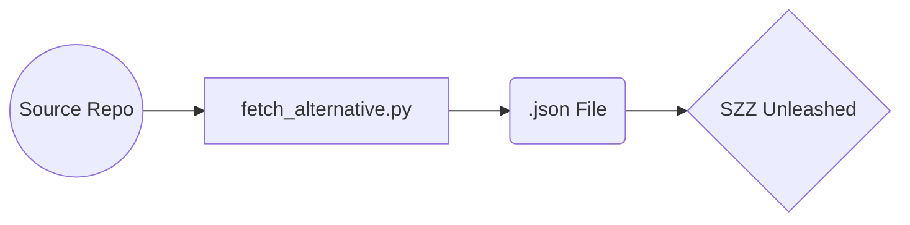

# Python script for SZZ Unleashed (fetch_alternative)
- Sustitute to fetch.py
- Uses the GitHub API
- 2.5 seconds sleeps to prevent any trouble with the GitHub API usage limit

## Usage

- python fetch_alternative.py < owner > < repository > 

## Note
- works only with projects using "bug" labels
- for projects with less than 840 bugs, the sleeps can be removed
- A token.env file containing a valid github token is required to use the script
	- GITHUB_TOKEN=\<your token> 

## Dependencies
- GitHub Token in token.env
- Python
	- json
	- math
	- time
	- datetime
	- dotenv 
	- os
	- requests
	- sys

## Using SZZ Unleashed

