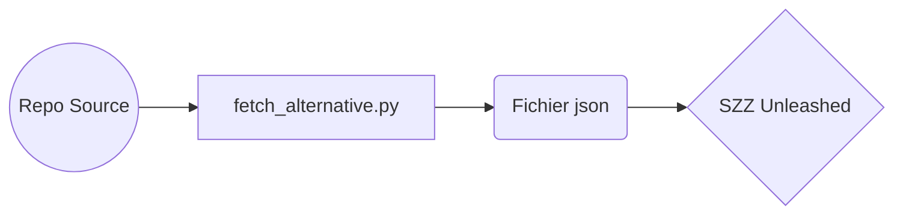

# Script pour utiliser SZZ Unleashed (fetch_alternative)
Script pour remplacer le script fetch.py de szz unleashed 

- Utilise l'API github
- sleep de 2.5 secondes pour s'assurer de ne pas être bloqué par la limite d'utilisation de l'API de github 
- English version of the readme [Here](https://github.com/MGL843-Equipe-3/SZZ-fetch_alternative/blob/main/EN_README.md)

## Utilisation

- python fetch_alternative.py <propriétaire> <répertoire> 

## Note
- fonctionne seulement pour les projets github utilisant un ou plusieurs labels "bug"
- le sleep peut être enlevé pour les projets ayant moins de 840 bogues (inclusivement) (28 pages) au total (tous labels confondu)
- Un fichier token.env contenant un token github valide est requis pour que le script fonctionne
	- GITHUB_TOKEN=\<votre token> 

## Dépendances
- GitHub Token dans un fichier token.env
- Python
	- json
	- math
	- time
	- datetime
	- dotenv 
	- os
	- requests
	- sys

## Utiliser SZZ Unleashed

